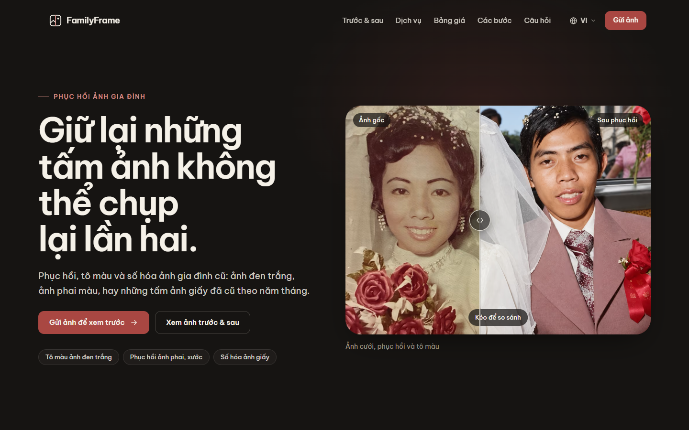
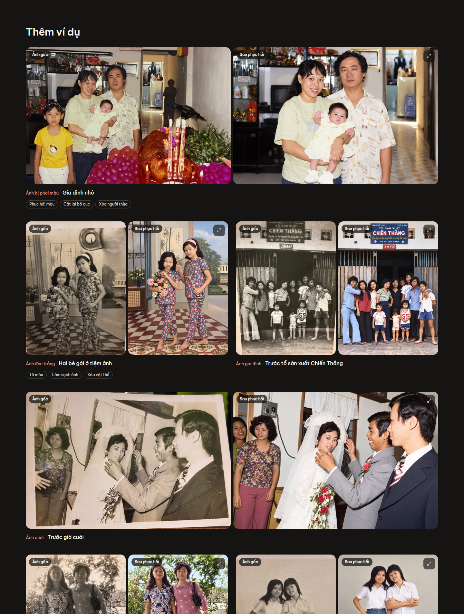
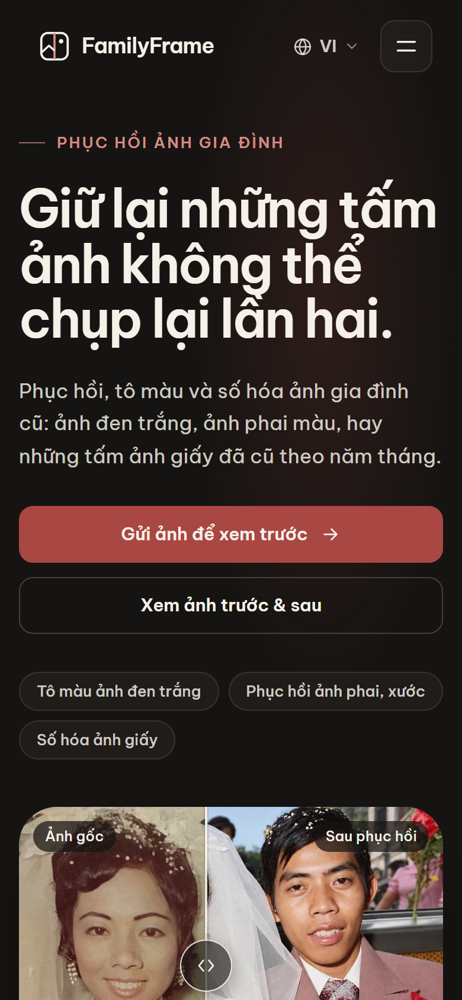

# FamilyFrame

Vietnamese-first landing page for restoring, colorizing, and digitizing old family photos.



FamilyFrame is a small, personal photo-restoration service. The page explains the service through real before/after examples, gives clear pricing, and invites visitors to send a photo for a preview. It loads in Vietnamese and can be switched to English, Traditional Chinese (Cantonese audience) and Simplified Chinese (Mandarin audience).

| Desktop                                                                | Mobile                                                           |
| ---------------------------------------------------------------------- | ---------------------------------------------------------------- |
|  |  |

A full-page desktop capture is in [`docs/screenshots/familyframe-full-desktop.jpg`](docs/screenshots/familyframe-full-desktop.jpg).

## Stack

- React 19 + TypeScript, built with Vite
- Plain CSS with design tokens (`src/styles/tokens.css`), one stylesheet per component
- Be Vietnam Pro (self-hosted via Fontsource) for full Vietnamese diacritic support; Chinese uses system CJK fonts
- Build-time prerendering of the Vietnamese page, hydrated on the client
- `sharp` for image optimization, Vitest + Testing Library for tests, ESLint (with `jsx-a11y`) and Prettier
- No UI framework, animation library or router

## Getting started

Requires Node 20.19+ (developed on Node 24).

```bash
npm install
npm run dev          # http://localhost:5173
```

Other scripts:

| Command                           | What it does                                                                   |
| --------------------------------- | ------------------------------------------------------------------------------ |
| `npm run build`                   | Typecheck, build, and prerender the Vietnamese HTML into `dist/`               |
| `npm run preview`                 | Serve `dist/` at http://localhost:4310                                         |
| `npm run lint`                    | ESLint                                                                         |
| `npm run typecheck`               | TypeScript project check                                                       |
| `npm test`                        | Unit and component tests                                                       |
| `npm run format` / `format:check` | Prettier                                                                       |
| `npm run images`                  | Regenerate optimized images from the PNG originals                             |
| `npm run screenshots`             | Capture `docs/screenshots/` from a running preview (uses local Chrome or Edge) |

Copy `.env.example` to `.env` to configure the site URL and contact channels.

## Project structure

```
src/
  i18n/            locale dictionaries, provider, persistence
  data/            restoration pairs + gallery layout, pricing
  config/          contact channels, section anchor ids
  components/      BeforeAfterSlider, Lightbox, Header, LanguageSelector, ...
  sections/        Hero, Gallery, Services, Pricing, Process, Philosophy, Trust, Faq, Contact, Footer
  styles/          tokens.css, base.css
scripts/           optimize-images, prerender, screenshots
public/restorations/<pair-id>/{before,after}-<width>.{avif,webp}
```

## Localization

- Locales: `vi` (default), `en`, `zh-Hant`, `zh-Hans`, in `src/i18n/locales/`.
- `vi.ts` is the source dictionary. Its shape is the `Dictionary` type, so the other locales must provide every key or the build fails.
- `src/i18n/dictionaries.test.ts` also checks that every locale has the same keys, the same list lengths, no empty strings, and the same `{placeholders}`.
- Components read copy with `const { t } = useI18n()`. No visible copy is hardcoded in components.
- The choice is stored in `localStorage` (`familyframe.locale`). `?lang=en` also works for shared links. If storage is blocked, the page stays in Vietnamese.
- On change, `<html lang>`, the document title, the meta description and the Open Graph tags are updated. CJK locales switch to system Chinese fonts and drop negative letter-spacing.

**SEO limitation:** locale switching is client-side on a single URL. Search engines index the prerendered Vietnamese page only. Separate indexable language pages would need per-locale routes (for example `/en/`) and prerendering each one.

## Adding before/after images

1. Put the full-resolution pair in `src/assets/images/before/<id>.png` and `src/assets/images/after/<id>.png`. The restoration should be portrait 1086×1448 or landscape 1448×1086; the original can be any size (crop it to the physical print, not the table around it). Add the entry to `src/assets/images/manifest.json`.
2. Run `npm run images`. This writes AVIF + WebP variants at 480/768/1080 (and 1440 for landscape) to `public/restorations/<id>/`.
3. Add the pair to `src/data/restorations.ts`:

   ```ts
   { id: '28_new_photo', category: 'blackWhite', orientation: 'portrait', presentation: 'slider', align: { scale: 1.02, x: 1.5, y: -3 } }
   ```

   - `presentation: 'slider'` only when the two photos line up spatially; otherwise `'pair'` shows them as two equal panels side by side.
   - `align` registers the original onto the restoration in a slider: scale about the centre, then shift by x / y percent of the frame. Leave it out when the photos already match.
   - `afterPosition` / `beforePosition` (e.g. `'50% 30%'`) set the crop focus when a frame crops a photo. Both panels always use the restored photo's frame, so an original with a different shape is cropped to it.
   - `techniques` (max 3) adds chips such as `recrop` or `objectRemoval`; labels live under `gallery.techniques` in each locale.

4. Add a `title` and `alt` for the id under `pairs` in **all four** locale files, plus an optional `description` of the work done. The tests fail if one is missing.
5. Place it on the page by adding the id to a slot in `layout` in the same file (`featureRows`, `immersive`, `rephotographed`, `more`, ...).

### Replacing a source image

Overwrite the PNG in `before/` or `after/` and run `npm run images`. Each source is hashed (with the encoder settings) into `src/assets/images/derivatives.json`, so only changed or missing images are re-encoded. `npm run images -- --dry-run` lists what would change, `--only=<id>[,<id>]` forces specific pairs and `--force` rebuilds everything. Commit `derivatives.json` along with the new variants.

The full-resolution PNGs (~245 MB, with `pairs/` duplicating `before/` + `after/`) are git-ignored; only the optimized variants are committed. Keep the originals backed up elsewhere.

## Pricing

Prices live in `src/data/pricing.ts` as numbers (USD):

```ts
{ id: 'standard', price: { amount: 15 }, featureLabel: 'includesLabel' },
{ id: 'advanced', price: { min: 20, max: 30 }, featureLabel: 'forLabel' },
{ id: 'bundle',   price: { amount: 100 }, featureLabel: 'includesLabel', highlight: true },
```

Plan names, units, summaries and feature lists are in each locale under `pricing.plans`. `highlight` gives the bundle a paper-colored card. There is no "most popular" badge on purpose.

## Contact CTA

There is no upload backend yet. Every "Gửi ảnh" button scrolls to the contact section. Its main button opens an email draft to `quang@quanghuynh.com` with a subject and body in the visitor's language. The copy lives in each locale under `contact.emailSubject` / `contact.emailBody`, and `buildMailtoHref` in `src/lib/mailto.ts` encodes it. Optional overrides in `.env`:

```bash
VITE_CONTACT_EMAIL=hello@example.com      # recipient; empty uses quang@quanghuynh.com
VITE_CONTACT_ZALO_URL=https://zalo.me/... # optional, button shown only when set
VITE_CONTACT_MESSENGER_URL=https://m.me/... # optional
VITE_SITE_URL=https://familyframe.example # adds canonical, og:url and absolute og:image
```

To switch to a form or upload service later, change `emailHref` / the buttons in `src/config/contact.ts` and `src/sections/Contact.tsx`.

## Accessibility

- Landmarks (`header`, `nav`, `main`, `footer`), one `h1`, ordered headings, and a skip link
- `BeforeAfterSlider`: a focusable `role="slider"` with `aria-valuetext` in the current language. It supports arrow keys, Shift+arrows, PageUp/PageDown, Home and End. Mouse drag works, and on touch a horizontal drag or tap moves the divider while vertical swipes still scroll the page (`touch-action: pan-y`)
- Lightbox uses native `<dialog>`: focus moves in, Escape closes, focus returns to the trigger, background scroll is locked
- FAQ uses `aria-expanded` disclosure buttons; collapsed answers are removed from the tab order
- Language menu supports arrow keys and Escape; options declare their own `lang`
- Visible focus rings, 44px+ touch targets, and AA contrast for all text, including the accent button
- `prefers-reduced-motion` disables reveal, slider and smooth-scroll animation
- Scroll-reveal is opt-in from JavaScript, so content is never hidden if scripts fail. The page is fully readable without JavaScript.

## Performance

- Prerendered HTML with inlined CSS; only the hero images are preloaded and loaded eagerly
- AVIF/WebP `srcset` with `sizes`, explicit dimensions, and `loading="lazy"` everywhere else
- Lighthouse (local production build): desktop 99 performance, 100 accessibility, 100 best practices, 100 SEO. Mobile (simulated slow 4G) 82–83 / 100 / 100 / 100.

## Known limitations

- No upload or contact backend. The CTA opens an email draft until a real channel is configured.
- Locale switching is client-side, so only Vietnamese is indexed (see Localization).
- Returning visitors who chose another language may briefly see the prerendered Vietnamese text until the script loads and applies their saved language.
- All four dictionaries ship in the main bundle (~94 KB gzipped JS in total). This was kept for instant switching without a flash; it could be split per locale later.
- Mobile LCP under simulated slow 4G is about 4 s, mostly the prerendered HTML size and font files.
- `13_badminton_portrait_scan_2` is a second scan of `08` and is not shown.
